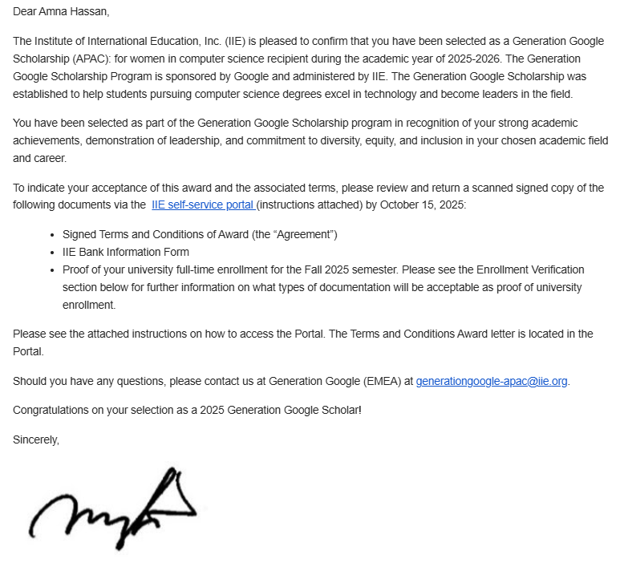

## Overview ✨

I am deeply honored to announce that I have been **selected as a Google Generation Scholar (APAC region) for the 2025–26 academic year**, receiving a **$2,500 scholarship** from Google.

This recognition is a milestone in my journey that began with learning to code at 15, sharing my first small games with my father, and growing into a passion for **technology, problem-solving, and mentorship**.

---

## Selection Email 📧

Here’s the official email I received from Google confirming my selection:

---

## Reflection 🌟

I am grateful to **Google** for this honor and to all mentors, peers, and students who have been part of this journey. This recognition motivates me to continue **learning, teaching, and building projects** that inspire, include, and uplift communities through technology.
